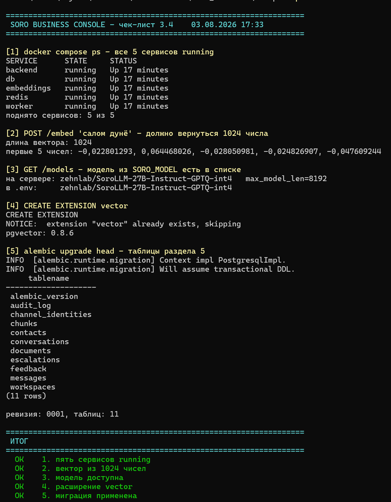

# Отклонения от ТЗ и вопросы тимлиду

Неделя 1. Всё, что пришлось сделать не так, как написано в
`TZ-Soro-Business-Console.docx` v1.0, — с причиной и вариантами решения.
Каждый пункт требует явного ответа: принять или откатить.

---

## 1. `documents.settings` — колонки нет в DDL, но её требует экран 02

**Раздел 5** описывает таблицу `documents` без поля `settings`.
**Раздел 9** для экрана «База знаний» пишет: «прогресс-бар индексации — из поля
`chunks_done`/`chunks_total` в `documents.settings`».

Взаимоисключающие требования. Добавил колонку:

```sql
settings JSONB NOT NULL DEFAULT '{}'
```

**Решить:** оставить колонку или убрать прогресс-бар с экрана 02.

---

> **Статус изменился.** Пункт 2 писался, когда роли были разделены и решение
> по паттернам принимал тимлид. Теперь проект целиком наш — паттерны
> переписаны, все 26 дефектов закрыты. Разбор в п. 23, текст ниже оставлен
> как история вопроса.

## 2. `core/pii.py` — 26 дефектов на 109 тестах, восемь форматов ПДн проходят без маски

Код взят из раздела 8.2 дословно. ТЗ предупреждает «карты раньше телефонов»,
но не замечает, что телефонный паттерн — это фактически 9 цифр подряд, и стоит
он **выше** ИНН. Проверено прогоном:

| Вход                                         | Получается | Ожидалось        |
| ------------------------------------------------ | -------------------- | ------------------------- |
| `ИНН нашей компании 123456789` | `[PHONE]`          | `[INN]`                 |
| `Номер договора 2026001234`       | `2[PHONE]`         | без изменений |
| `Корти ман 5058 1234 5678 9012 кор` | `[CARD]кор`     | `[CARD] кор`         |

Третий случай — паттерн карты `(?:\d[ -]?){13,19}` захватывает пробел после
последней цифры, слова слипаются.

Все три оформлены как `xfail(strict=True)` в `app/tests/test_pii.py`.

### 2.1. Набор тестов расширен до 109

ТЗ требует 10 примеров. Десяти мало: они построены по образцам из самого ТЗ,
то есть проверяют ровно те случаи, на которые паттерны и рассчитаны. Набор
доведён до 109 тестов, и на реальных форматах модуль посыпался.

```
83 passed, 26 xfailed      0,35 с
```

| Группа | Всего | Проходят | xfail |
|---|---|---|---|
| Карты | 21 | 17 | 4 |
| Телефоны | 15 | 11 | 4 |
| Паспорта | 7 | 7 | — |
| ИНН | 3 | — | 3 |
| Счета и IBAN | 5 | — | 5 |
| Чистый текст | 30 | 30 | — |
| Лишнее маскирование | 5 | — | 5 |
| Несколько ПДн в сообщении | 11 | 10 | 1 |
| Склейка слов | 4 | — | 4 |
| Свойства функции | 8 | 8 | — |

**26 xfail — это полный перечень дефектов**, у каждого причина написана прямо
в `reason`. Тридцать негативных случаев (даты, время, проценты, суммы с
пробелами, годы, коды валют) добавлены как страховка: при исправлении
паттернов их легко сделать слишком жадными.

Отдельно проверены свойства функции, которых в ТЗ нет: **идемпотентность**
(`mask(mask(x)) == mask(x)` — важно, потому что `text_masked` может пройти
через `mask()` второй раз при пересылке оператору или в аудит), отсутствие
мутации входа, работа с пустой строкой.

### 2.2. Прогон на реальных банковских форматах — модуль пропускает ПДн

**Проходят насквозь, без маски:**

| Вход | Результат | Почему |
|---|---|---|
| `Корт 5058.1234.5678.9012` | не тронут | в паттерне карты разрешены только пробел и дефис, **точки нет** |
| `5058⇥1234⇥5678⇥9012` | не тронут | табуляция не предусмотрена — встречается при копировании из таблиц |
| `Корт 5058  1234  5678  9012` | не тронут | допускается ровно один пробел между группами |
| `корти5058123456789012ман` | не тронут | `\b` не срабатывает между кириллической буквой и цифрой |
| `Телефон (93) 123-45-67` | не тронут | скобки вокруг кода оператора не предусмотрены |
| `Занг: +992 (93) 123 45 67` | не тронут | то же, но с кодом страны |
| `Номер 900 12 34 56` | не тронут | группировка 3-2-2-2, а паттерн ждёт 2-3-2-2 |
| `занг+992931234567лутфан` | не тронут | номер внутри слова, нет границы |

Восемь способов записи, все — обычная человеческая переписка.

**Маскируются частично — часть цифр остаётся открытой:**

| Вход | Результат | Что осталось |
|---|---|---|
| `счёт 20206972000123456789` | `20206972000[PHONE]` | **первые 11 цифр счёта** |
| `Счёт 2020 6972 0001 2345 6789` | `[CARD]6789` | последние 4 |
| `IBAN TJ02 0000 0000 0000 0000 0000 0001` | `TJ02 [CARD]0000 0001` | начало и хвост |
| `IBAN TJ020000000000000000000001` | `TJ020000000000000[PHONE]` | первые 17 символов |

Это опаснее полного пропуска: строка **выглядит** обработанной — в ней стоит
метка, — но данные в ней остались. Ни в инбоксе, ни в аудите этого не заметят.

**Ложные срабатывания** — четыре вида длинных чисел, не являющихся ПДн:

`Код 123456789012` → `123[PHONE]` · `Рақами 12345678901` → `12[PHONE]` ·
`Транзакция 9876543210` → `9[PHONE]` · `Номер договора 2026001234` → `2[PHONE]`

### 2.3. Замечание о качестве самих тестов

Первый прогон расширенного набора дал шесть `XPASS(strict)` на группе счетов.
Причина была в ассерте: проверялось «полной строки нет в выводе», а при
частичном маскировании она и правда исчезает — `20206972000123456789`
превращается в `20206972000[PHONE]`, подстроки нет, тест зелёный. При этом
одиннадцать цифр счёта остались на месте.

Заменено на «от номера счёта не осталось ни одной цифры», в группе смешанных
сообщений добавлена проверка на остаток `\d{5,}` (порог пять — чтобы не
цеплять годы `2026` и суммы `500`).

Вывод общий: **проверка «ПДн замаскированы» через поиск исходной подстроки
не работает**. Частичная маска её обходит. Проверять надо остаток цифр. Это
касается не только `pii.py` — та же ошибка возможна в тестах инбокса и аудита
на неделе 5.

### 2.4. Выводы

1. **Ни счёта, ни IBAN в паттернах нет вообще.** Продукт для банка, а два
   самых банковских идентификатора в разделе 8.2 не описаны. Ловятся только
   случайно, обрывками, чужими паттернами.
2. **Регэкспы применяются к сырому тексту.** Отсюда все восемь промахов с
   разделителями. Лечится не новыми паттернами, а нормализацией перед
   маскированием: привести разделители к одному виду, потом искать.
3. **Формулировка «утечки нет, маскируется лишнее» неверна.** Она справедлива
   только для набора из ТЗ. На реальных форматах восемь способов записи ПДн
   проходят целиком и четыре маскируются частично.
4. **Двадцать шесть дефектов задокументированы исполняемыми тестами.** Не
   рассуждение, а список конкретных строк с фактическим и ожидаемым выводом.
   После любой правки паттернов сразу видно, что закрылось, а что нет.

**Решить (по возрастанию объёма работ):**

| Вариант | Что закрывает | xfail |
|---|---|---|
| поднять ИНН выше телефона | метка ИНН | 3 |
| сузить телефонный паттерн, убрать `[ -]?` из хвоста карты | жадность и склейку слов | 9 |
| нормализация разделителей перед маскированием | точки, табы, двойные пробелы, скобки, слитное написание | 8 |
| добавить паттерны счёта (20 цифр) и IBAN `TJ\d{2}…` | частичные маскирования | 6 |

Первые два пункта — правка на полчаса, закрывают 12 дефектов из 26. Последние
два означают, что раздел 8.2 ТЗ надо переписывать, и это решение уровня
тимлида, а не стажёра.

---

## 3. Образ TEI `cpu-1.5` из раздела 3.3 нерабочий

**Симптом:** контейнер `embeddings` падает сразу после старта:

```
Error: Could not download model artifacts
Caused by: relative URL without a base
```

**Причина найдена, к сети не относится.** Hugging Face доступен и с хоста, и из
контейнера (HTTP 200). Но на запрос файла модели отвечает редиректом с
**относительным** Location:

```
HTTP/2 307
location: /api/resolve-cache/models/BAAI/bge-m3/…/config.json
```

Внутри `cpu-1.5` библиотека `hf-hub 0.3.2`, которая такой Location не
разбирает. `curl` разбирает, поэтому проверить руками легко.

Зеркало `hf-mirror.com` не помогает — отвечает 308-м редиректом обратно на
`huggingface.co`, и библиотека упирается в то же самое.

**Сделано:** тег поднят до `cpu-latest`. bge-m3 та же, размерность те же 1024,
`/embed` работает.

**Альтернатива, сохраняющая исходный тег:** скачать веса bge-m3 вручную и
положить в volume `teidata` в формате кеша HF — тогда TEI не пойдёт в сеть.

**Решить:** зафиксировать `cpu-latest` в ТЗ или готовить volume с весами.

---

## 4. Памяти на прогрев эмбеддингов нужно ~10 ГБ

Измерено на этой машине (16 ГБ RAM):

```
soro-business-embeddings-1   9.799GiB / 10.7GiB   91.62%   CPU 1098%
```

Это **до единого запроса**, только прогрев модели с `--max-batch-tokens 16384`
из раздела 3.3. При стандартном лимите WSL2 (50% RAM хоста = 7,98 ГБ)
контейнер убивается ядром: `Exited (137)`, `OOMKilled=true`.

**Сделано:** на машине создан `C:\Users\<user>\.wslconfig` с `memory=11GB`.
Это настройка окружения, не правка проекта — файлы ТЗ не тронуты.

**Что это значит для команды:** на ноутбуке с 16 ГБ стек поднимается впритык,
с запасом меньше гигабайта. У кого 8 ГБ — не поднимется вообще.

**Решить:** снижать ли `--max-batch-tokens` (например до 4096) для
разработки, оставив 16384 только на сервере.

---

## 5. В compose не было общего тома для загрузок

**Раздел 6.1:** файл сохраняется в `/data/uploads/{workspace}/{uuid}.{ext}`,
после чего задача уходит в RQ, и воркер этот файл читает.

В `docker-compose.yml` из раздела 3.3 такого тома нет — `backend` записал бы
файл в свою файловую систему, а `worker` его не увидел. Индексация не
заработала бы ни разу.

**Сделано:** добавлен том `uploads`, смонтирован в оба сервиса.

---

## 6. `backend/Dockerfile`: порядок COPY

`pip install -e .` заставляет setuptools искать пакет `app`, а он копировался
строкой ниже — сборка падала. Добавлена строка `COPY app ./app` до установки.

---

## 7. `app/main.py` создан минимальным

Файл описан в разделе 2.3 и принадлежит Разрабу A, но без него команда
`uvicorn app.main:app` из compose не стартует и проверка №1 чек-листа 3.4 не
проходит. Сейчас внутри только создание `FastAPI` и `/health`.

**На ревью:** дописать роутеры и CORS.

---

## 8. На сервере развёрнута не та модель, что в ТЗ

Раздел 2.2 и `.env.example` фиксируют **Soro-27B FP8**, имя модели
`soro-27b-fp8`. Проверка №3 чек-листа 3.4 требует найти это имя в списке.

Фактически `GET /v1/models` отдаёт:

```
zehnlab/SoroLLM-27B-Instruct-GPTQ-int4   max_model_len=8192
```

Другое имя и **другая квантизация**: не FP8, а GPTQ-int4. С `SORO_MODEL=soro-27b-fp8`
любой запрос вернул бы «model not found», поэтому в `.env` прописано
фактическое имя.

Что стоит уточнить у тимлида и DevOps:

- это временный тестовый эндпоинт или целевой?
- int4 вместо FP8 — осознанное решение? На качестве таджикских ответов
  квантизация до 4 бит сказывается заметнее, чем FP8, а раздел 6.5 требует
  ноль выдуманных ответов на golden set.
- `max_model_len=8192` — при `RAG_RETURN_K=3` фрагментами по 400–500 токенов
  плюс системный промпт запас есть, но на вырост это стоит помнить.

**Отдельно про формат `SORO_API_URL`.** Значение было вписано как
`http://…:8000/v1/chat/completions`. ТЗ ожидает базовый путь `/v1`: проверка
собирает `$SORO_API_URL/models`, и с полным путём получался 404. Исправлено
на `http://18.191.170.205:8000/v1`.

---



## 9. Мелочи, на которые стоит посмотреть

- **pgvector 0.8.6 вместо 0.7.** ТЗ фиксирует 0.7, но образ `pgvector/pgvector:pg16`
  ставит 0.8.6. Обратно несовместимых изменений для нас нет, HNSW и
  `vector_cosine_ops` работают.
- **Node 20 LTS вышел из поддержки** в апреле 2026, в winget ветки 20 больше нет.
  Поставлен 20.20.2 через fnm, `.node-version` в корне репозитория; системный
  Node 24 не тронут.
- **Эталонный HTML.** ТЗ ссылается на `soro-business-console.html`, в задаче
  лежит `soro-business-console-2.html`. Зафиксировать до недели 4.
- **`models.py`, колонка `text`.** В классах `Message` и `Chunk` имя колонки
  перекрывало функцию `sqlalchemy.text` внутри тела класса — миграция падала с
  `TypeError: 'MappedColumn' object is not callable`. Импорт переименован в
  `sql_text`. Это не отклонение от ТЗ, а обычная ошибка, но знать полезно: та же
  ловушка ждёт всех, кто пишет модели с колонкой `text`.

---
---

# Неделя 2 — `ingest/crawler.py` + тесты парсеров

Сделано: `ingest/parsers.py`, `ingest/crawler.py`, тесты на обоих
(`app/tests/test_parsers.py`, `app/tests/test_crawler.py`), генератор
документов `app/tests/factories.py`, фикстурный сайт
`app/tests/fixture_site.py`, скрипты `scripts/bench_index.py` и
`scripts/crawl_site.py`.

Сырые логи всех прогонов, на которых построены выводы ниже, лежат в
`logs/` (см. `logs/README.md`): тесты, боевой обход сайта, замеры
индексации, парсер на реальных PDF.

Два входных условия недели не выполнились, и это повлияло на объём:

| Что обещано | Кем | Факт |
|---|---|---|
| 3 реальных PDF банка | тимлид | не получены → взял четыре с сайта банка сам, см. п. 18 |
| `tesseract-ocr-tgk` в Dockerfile | Разраб A | **сделано ещё на неделе 1**, OCR-ветка проверена |
| `ingest/parsers.py` | Разраб A | не написан → написан мной, см. п. 10 |

---

## 10. `parsers.py` написан мной, а не Разрабом A

Задача недели — «тесты парсеров», то есть предполагается, что парсеры уже
есть. В репозитории `ingest/` пустой. Ждать — потерять неделю, поэтому
модуль написан целиком по таблице 6.2.

**Решить:** принимаем реализацию как есть или A переписывает под себя. Если
второе — тесты останутся, они привязаны к контракту (`parse_file` → список
`ParsedPage`), а не к внутренностям.

---

## 11. Фикстуры синтетические, реальных PDF банка нет

`app/tests/factories.py` собирает PDF/DOCX/XLSX на лету: таджикский с
диакритикой (ӣ ӯ ҳ ҷ ғ қ), проценты, суммы в сомонӣ, таблицы курсов,
отдельно — **скан** (страница отрисована в картинку, текстового слоя нет)
для OCR-ветки.

Бинарники в git не кладём: они протухают, а генератор всегда собирает
актуальную версию.

**Чего синтетика не проверит:** вёрстку настоящих банковских PDF —
многоколоночные тарифы, сноски мелким шрифтом, таблицы на пол-страницы,
пересканированные копии копий. Именно там парсер обычно и ломается.

Реальные PDF в итоге нашлись сами: их выдал собственный краулер на сайте
банка, см. п. 18. Так что критерий сдачи закрыт по-настоящему, а не на
синтетике. **Но фикстуры остаются синтетическими сознательно** — тесты не
должны зависеть от сети и от того, что банк переложил файл; проверка на
реальных документах вынесена в отдельный скрипт.

---

## 12. `chunks.page INT` не может хранить «URL-хвост»

DDL раздела 5:

```sql
page  INT,   -- страница/лист/URL-хвост
```

Для PDF это номер страницы, для XLSX — номер листа, а для сайта комментарий
обещает URL-хвост, который в `INT` не влезает. Краулер отдаёт страницы с
полным URL (`CrawledPage.url`), но куда его класть при записи чанков —
вопрос к владельцу `ingest_document`.

Три варианта:

1. `page` → `TEXT` (правка DDL и миграции, ломает сравнение с эталоном);
2. одна строка `documents` на каждую страницу сайта, `source_url` = URL,
   `page` = NULL — тогда ссылка в ответе бота ведёт на конкретную страницу;
3. `page` = порядковый номер страницы в обходе, карта «номер → URL» в
   `documents.settings`.

**Рекомендую вариант 2:** он единственный даёт корректную сноску
«Манбаъ: <название страницы>» со ссылкой, а сноски — часть демо.

---

## 13. Решения по краулеру, которые ТЗ оставило исполнителю

Все они перечислены в шапке `crawler.py` и закрыты тестами. Нужно
подтверждение A — потом менять будет дороже.

| # | Вопрос | Решение |
|---|---|---|
| 1 | дедупликация URL | нижний регистр схемы/хоста, срез якоря, срез хвостового `/`, срез стандартного порта, сортировка query, выброс `utm_*`/`gclid`/`fbclid`/`_ga`. `/tarify`, `/tarify/`, `/tarify#rates`, `/tarify?utm_source=fb` — одна страница |
| 2 | редирект на другой домен | обрываем: страницу не индексируем, ссылки с неё не берём |
| 3 | PDF и прочие не-HTML | не качаем, собираем список в `CrawlResult.assets` — скачивание это ingest, зона A |
| 4 | таймауты и ретраи | 10 сек ответ / 5 сек соединение; 2 повтора на сетевую ошибку и 5xx с паузой 1 сек; 4xx не повторяем |
| 5 | title | `<title>` → `<h1>` → хвост URL |
| 6 | кодировки | заголовок Content-Type → `<meta charset>` → UTF-8 с заменой. Сайты банков РТ регулярно отдают windows-1251 молча |
| 7 | глубина | старт = 0, `MAX_DEPTH=3` — три уровня ссылок от старта включительно |
| 8 | поддомены | чужой домен: `blog.eskhata.tj` — другой сайт, а лимит 150 страниц один |
| 9 | Crawl-delay | если robots.txt просит больше 0,5 сек — слушаемся его |

Отдельно: **ссылки собираются из исходного HTML, а не из очищенного.** ТЗ
велит выкидывать `nav`/`footer` из текста — но именно там лежит меню сайта.
Выкинуть их до сбора ссылок значит увидеть одну страницу и остановиться.

---

## 14. Трактовка правила про таблицы в DOCX

ТЗ: «таблицу превращать в строки вида «Ячейка1 | Ячейка2», заголовок
таблицы повторять в каждой строке». Буквально это два разных требования.
Принято так:

```
Валюта: USD | Купля: 10,90 | Продажа: 11,05
```

Заголовок приклеен к своей ячейке. Причина: чанкер режет текст по абзацам,
строка таблицы легко отрывается от шапки, и в отрыве «USD | 10,90 | 11,05»
бессмысленно. Побочная польза — совпадает с форматом XLSX
(«Заголовок_колонки: значение; ...»), и таблицы из обоих форматов выглядят
в поиске одинаково.

---

## 15. Мелкие правки инфраструктуры

- **`docker-compose.yml`:** добавлен монтаж `./scripts:/code/scripts` —
  иначе `bench_index.py` (и `eval_rag.py` недели 3) негде запускать: все
  зависимости стоят только внутри образа.
- **`backend/Dockerfile`:** `pip install -e ".[dev]"` вместо `-e .` —
  pytest теперь есть в образе. Тесты обязаны идти внутри контейнера:
  OCR-ветке нужен tesseract с `tgk+rus`, на Windows его нет.
- **`page.get_pixmap(dpi=300)`** перед OCR — dpi в ТЗ не задан. На 150
  tesseract заметно хуже берёт таджикскую диакритику.

---

## 16. Замер индексации: норматив «40 страниц < 3 минут» держится только на бумаге

Мерил `scripts/bench_index.py`: парсинг → нарезка по 6.3 → эмбеддинги
батчами по 32 в TEI. Запись в БД не входит (её ещё некому делать), но её
вклад на фоне эмбеддингов — доли процента.

| Что мерил | Страниц | Символов/стр. | Фрагментов | Время | Норматив 180 сек |
|---|---|---|---|---|---|
| редкий текст | 40 | 176 | 40 | **23 сек** | с запасом ×8 |
| плотный текст, машина под нагрузкой | 40 | 2147 | 100 | **127–145 сек** | впритык |
| плотный текст, машина разгружена | 40 | 2147 | 100 | **89 сек** | с запасом ×2 |
| скан (OCR) | 5 | 147 | 5 | **42 сек** | — |

**Разброс на одном и том же файле — от 89 до 145 секунд.** Это важнее
самих цифр: разница в полтора раза объясняется не кодом и не параметрами
TEI, а тем, сколько на машине свободной памяти в момент прогона. Замер
89 сек снят на разгруженной машине с `--max-batch-tokens 4096`, замеры
127–145 сек — с 16384, но при открытом VS Code и нехватке памяти.

Практический вывод: **норматив «40 страниц < 3 минут» нельзя проверять на
занятом ноутбуке**. Цифру для тимлида надо снимать на том железе, где
будет крутиться демо, и с оговоркой о загрузке.

Три вывода, каждый требует решения:

1. **Время уходит не туда, куда кажется.** Парсинг и нарезка — 0,3% времени,
   эмбеддинги — **99,7%**. Число фрагментов зависит не от страниц, а от
   объёма текста, поэтому «40 страниц» без указания плотности — не норматив.
   Один фрагмент стоит **1,27–1,45 сек** на CPU.
2. **Плотный документ норматив уже не держит.** Измеренные 145 сек при 2147
   символах на страницу — это 80% лимита. Прогноз по цене фрагмента:
   3000 символов на страницу → **~203 сек**, за нормативом. Между двумя
   прогонами одного и того же файла разброс 127 → 145 сек (машина занята) —
   то есть запаса нет вообще.
3. **Скан норматив не держит с разгромом.** OCR стоит **8,1 сек на
   страницу**; 40-страничный скан — **~325 сек только на распознавание**,
   почти вдвое больше лимита. А шаг 1 сценария приёмки (раздел 6.1 задач
   недели 6) требует «2 PDF + сайт за ≤ 5 минут» — два скана туда не
   влезают.

**Что предлагаю:** поднять вопрос о GPU-образе TEI сейчас, как и советуют
ловушки недели 2. В `docker-compose.yml` уже стоит комментарий, что на GPU
образ меняется на `:1.5` (cuda) и даёт ~20×. Если GPU не будет — просить
переформулировать норматив: «40 страниц текста средней плотности», а для
сканов записать отдельную цифру.

---

## 17. Боевой прогон по сайту банка: три находки

`scripts/crawl_site.py https://eskhata.tj/ --max-pages 25` — лимит снижен
намеренно, полный обход 150 страниц это лишняя нагрузка на чужой прод.

**Находка 1 (уже исправлена).** `eskhata.tj` отвечает редиректом на
**другой домен** — `eskhata.com`. По правилу «редирект наружу обрываем»
краулер умирал на первом же запросе: 0 страниц, «сайт обойдён целиком».
Исправлено: стартовому URL разрешено переехать, robots.txt при этом
перечитывается у нового домена. Внутренним страницам переезд наружу
по-прежнему запрещён. Оба случая закрыты тестами.

**Находка 2 — пагинация ест лимит, но не так страшно, как показалось
сначала.** Движок сайта (1С-Битрикс) плодит комбинации
`?PAGEN_1=…&PAGEN_2=…&PAGEN_3=…`, и они уходят в очередь как разные
адреса: за полный обход отброшено **14 555 дублей URL**. Нормализация тут
не помогает — параметры значимые.

Первая версия отчёта делала из этого вывод «весь лимит уйдёт на листалку,
до тарифов обход не дойдёт». **Вывод был неверен** — он опирался на
прогон, испорченный моим же дефектом со слэшем (находка 3). После правки
полный обход на 150 страниц даёт:

| | было (со срезанным слэшем) | стало |
|---|---|---|
| проиндексировано | 87 | **149** |
| содержательных страниц | 20 | **123** |
| пагинация | 67 | 26 |
| страниц про вклады, карты, кредиты | **0** | **20** |
| ошибок загрузки | 160 | 28 |

То есть лимита 150 хватает: в базу попадают `/depo/fixed/`, `/depo/ozod/`,
`/depo/profit/`, `/card/visa-gold/`, `/corporate/loans/`,
`/business/micro-loans/` — ровно те разделы, ради которых RAG и делается.
Пагинация занимает 17% выдачи, а не всё подряд.

**Вопрос к тимлиду остаётся, но становится мягче:** индексировать весь
сайт или ограничиться разделами продуктов. Второе даёт чище базу, первое
— не требует ручного списка. Мой голос за полный обход плюс фильтр
`PAGEN_*`: тогда 150 страниц уйдут только на содержательные.

**Находка 3 — «88 битых ссылок на сайте банка» оказались моим дефектом.**
Первая версия отчёта утверждала, что сайт полон мёртвых ссылок. Это
неверно, и проверка заняла одну команду:

```
404  https://eskhata.com/events/esg/eco-otvetstvennyy
200  https://eskhata.com/events/esg/eco-otvetstvennyy/
```

Хвостовой слэш обязателен, а моя нормализация его срезала — и краулер
ходил по адресам, которых у сайта нет. Так ведут себя Битрикс, Django и
вообще все с `APPEND_SLASH`, то есть добрая половина банковских сайтов.

Исправлено разделением на две операции: `clean_url` — канонизация, которая
не меняет ресурс (по такому адресу можно ходить), `normalize_url` — ключ
сравнения со срезанным слэшем (только для дедупликации). Разбор в
п. 20.

Дополнительно: `robots.txt` у `eskhata.com` ничего нам не запрещает,
Crawl-delay не задан. Ходили с паузой 0,5 сек, 25 страниц за 103 сек.

---

## 18. Парсер на реальных документах банка

Краулер нашёл на сайте девять PDF, четыре из них прогнаны через
`parse_file` (`scripts/check_real_pdf.py`):

| Документ | Стр. | Символов | Через OCR | Время |
|---|---|---|---|---|
| Тарифы физлиц | 12 | 23 330 | 0 | 0,5 сек |
| Тарифы юрлиц | 14 | 27 160 | 0 | 0,1 сек |
| График приёма граждан | 3 | 3 865 | 0 | 0,03 сек |
| Годовой отчёт 2023 | 17 | 4 853 | **6** | 15,5 сек |

Что это даёт:

- **Критерий сдачи закрыт настоящими документами**, включая OCR-ветку:
  в годовом отчёте шесть страниц-инфографик без текстового слоя ушли в
  `pytesseract` — ровно тот случай, ради которого порог 40 символов и
  писался. Цена — 2,6 сек на страницу OCR против 0,01 сек на обычную.
- **Таджикского в тарифах почти нет.** В «Тарифах физлиц» на 23 тысячи
  символов — 12 таджикских букв, в «Тарифах юрлиц» — 2. Документы
  русскоязычные. А демо строится на вопросе про вклад **на таджикском**
  (сценарий приёмки, шаг 2). **Вопрос тимлиду: на каких документах бот
  вообще будет отвечать по-таджикски?** Двуязычный документ нашёлся только
  один — «График приёма граждан», где таджикский и русский идут вперемешку
  в одной таблице. Это же и риск для поиска: `tsvector('simple')` по такому
  тексту даст мешанину.
- **Ловушка в именах файлов.** Ссылка на «Тарифы юрлиц» на сайте записана в
  нормализации **NFD**: «й» там это «и» + U+0306. Собранное «обычным» способом
  имя даёт 404. То же ждёт `ingest` при сохранении в
  `/data/uploads/{workspace}/{uuid}.{ext}` — с UUID в имени проблемы нет, но
  если кто-то решит сохранять исходное имя, файл на Windows и на Linux
  окажется разным. В `check_real_pdf.py` адрес оставлен процентно-кодированным
  намеренно.
- **Ссылка на таджикские «Қоидаҳои хизматрасонӣ» с сайта банка битая** —
  404. Просьба к тимлиду передать банку: это как раз тот документ, который
  нужен демо.

---

## 19. Пять дефектов, найденных перечитыванием кода, — исправлены

Разбор кода целиком вынесен в `WALKTHROUGH-week2.md`. По ходу разбора
нашлись пять собственных дефектов; ни один не всплыл в тестах, все
исправлены и закрыты тестами.

| # | Что было | Чем грозило |
|---|---|---|
| 1 | лимит 150 сравнивался с числом **проиндексированных** страниц | на сайте с пустыми страницами обход делал кратно больше запросов к чужому серверу, чем разрешает ТЗ, — и молча |
| 2 | конечный адрес редиректа не запоминался | `/moved → /about` скачивался повторно и ложился в базу знаний дублем |
| 3 | `assets` дедуплицировался только в одной из двух веток | один файл попадал в отчёт дважды |
| 4 | `<base href>` не учитывался | относительные ссылки собирались валидные, но не те |
| 5 | страница разбиралась парсером дважды | лишняя работа на каждой странице |

По п. 1 изменился смысл счётчика: `stats.fetched` — это теперь «успешные
запросы», строка в отчёте переименована. **Это тоже трактовка ТЗ:** фраза
«максимум 150 страниц» понята как ограничение нагрузки на сайт банка, а не
как размер нашей базы. Если тимлид имел в виду второе — правится одной
строкой.

Числа боевого прогона после правок не изменились: 25 запросов, 25 страниц
с текстом, глубина 2, стоп по лимиту.

---

## 20. Нагрузочный прогон: ещё два дефекта, оба серьёзные

Тесты гоняют краулер по полигону из десятка страниц, боевой прогон — по
чужому сайту, который нельзя воспроизвести. Между ними была дыра, и в неё
провалились два дефекта. Закрыта скриптом `scripts/stress_crawl.py`:
синтетический сайт на 1000 страниц с ветвлением 6, перекрёстными ссылками,
дублями адресов в пяти написаниях, редиректами, битыми ссылками и глубиной
заведомо больше трёх.

Скрипт проверяет инварианты, которых на маленьком полигоне не видно:
запросов ровно `MAX_PAGES`, ни один URL не проиндексирован дважды, нет двух
документов с одинаковым текстом, глубже трёх не ушли, запрещённое
robots.txt не тронуто. Заодно меряет время и пик памяти.

### Дефект 6: дубли по содержимому

На 149 проиндексированных страницах — **20 копий** (13%): одна и та же
страница доступна по нескольким адресам (`/p6` и `/p6?a=1&b=2`), для
краулера это разные URL, а текст слово в слово один.

Для базы знаний это хуже, чем кажется: дубли фрагментов перекашивают
выдачу гибридного поиска. Один и тот же абзац занимает два места из трёх в
топе, и `RAG_RETURN_K = 3` фактически превращается в один источник — при
том что порог 0,65 сравнивается с косинусом лучшего кандидата и ничего
такого не ловит.

Исправлено: текст сравнивается по sha1, копия в базу не идёт. Тонкость —
копия, найденная **выше** по дереву, ссылки отдать обязана, иначе
дедупликация молча срезает охват обхода; на это есть отдельный тест.

### Дефект 7: срезанный хвостовой слэш ломал половину сайта

Описан в п. 17, находка 3. Здесь важно, чем он обернулся: до правки
полный обход давал 87 страниц и **ни одной** страницы про вклады и карты;
после — 149 страниц, из них 20 продуктовых. Дефект не падал, не логировался
как ошибка и выглядел как «плохой сайт у банка».

Мораль на будущее: если внешняя система «сама виновата» — это первое, что
надо проверить командой, а не записывать в отчёт.

### Цифры прогона

```
1000 страниц полигона, лимиты ТЗ, задержка 0
успешных запросов:   150 (ровно лимит)
страниц с текстом:   129
дубли URL отсечены:  492
копии по тексту:     20
время:               8 сек (53 мс/страница)
пик памяти:          4,9 МБ
все 6 инвариантов:   OK
```

53 мс на страницу — это чистая работа краулера без сети: разбор HTML,
нормализация, дедупликация. На боевом обходе с паузой 0,5 сек и реальными
ответами сервера выходит ~1 сек на страницу, то есть **150 страниц ≈ 2,5
минуты**. Для шага 1 сценария приёмки («сайт + 2 PDF за ≤ 5 минут») это
приемлемо, но вместе с индексацией PDF (п. 16) укладываемся впритык.

Тесты после обеих правок: **170 passed, 26 xfailed** (+9 к прошлому
прогону).

---

## 21. Краулер доведён до буквы ТЗ + прогон по восьми банкам РТ

### Сверка с разделом 6.2

| Требование | Было | Стало |
|---|---|---|
| обход в ширину | да | да |
| только тот же домен | да | да |
| максимум 150 страниц | да | да |
| глубина 3 | да | да |
| задержка 0,5 сек | да | да |
| **уважать robots.txt** | только файл | файл + `<meta name="robots">` + `rel="nofollow"` |
| main/article/body без служебных тегов | да | да |

Формально ТЗ выполнялось и раньше, но «уважать robots.txt» — это про
намерение сайта, а оно записывается в трёх местах, не в одном. Добавлено
ещё четыре вещи, без которых на реальных CMS краулер работает
неправильно:

1. **`<link rel="canonical">`** — сайт сам говорит, какой у страницы
   настоящий адрес. Для Битрикса это штатный способ сказать
   «`/events/?PAGEN_1=3` — это всё та же `/events/`», то есть системное
   решение проблемы пагинации из п. 17. На `alif.tj` сработало 4 раза за
   30 страниц.
2. **`429 Retry-After`** — не ошибка, а просьба притормозить: ждём столько,
   сколько попросили (не больше минуты), и повторяем.
3. **Потолок 5 МБ на страницу** — всё, что больше, не документ, а
   выгрузка. Ограничение неполное: тело уже скачано, полная защита требует
   потокового чтения. Записано в известные ограничения.
4. **Сессионные параметры** (`PHPSESSID`, `jsessionid`, `sessionid`) чистятся
   наравне с рекламными: они плодят по новому URL на каждый заход. Заодно
   исправлено сравнение параметров — раньше фильтр по префиксу выбросил бы
   `_gap` вместе с `_ga`, а регистр процентного кодирования (`%d0` против
   `%D0`) давал разные ключи для одного адреса.

### Прогон по восьми банкам (`scripts/crawl_many.py`, 30 страниц на сайт)

| Сайт | Стр. | Ошибок | Дублей URL | PDF | Тадж. текста | Итог |
|---|---|---|---|---|---|---|
| eskhata.tj | 29 | 1 | 3394 | 12 | 0,0% | ок (переезд на `.com`) |
| amonatbonk.tj | 30 | 1 | 6420 | 2 | 4,7% | ок |
| alif.tj | 23 | 0 | 872 | 0 | 3,9% | ок, 4 canonical |
| humo.tj | 12 | 0 | 132 | 0 | 5,5% | ок, сайт обойдён целиком |
| ibt.tj | 0 | 1 | — | — | — | **TLS: нет цепочки сертификатов** |
| arvand.tj | 0 | 1 | — | — | — | **TLS: нет цепочки сертификатов** |
| tsb.tj | 0 | 1 | — | — | — | **TLS: рукопожатие отклонено** |
| orienbank.tj | 0 | 1 | — | — | — | таймаут соединения |

Ни одна неудача не связана с краулером — это проверено: те же сайты с
браузерным User-Agent ведут себя так же.

### Главная находка: у трёх банков из восьми сломан TLS

```
ibt.tj    | TLS 1.2 | сертификат есть, цепочка не проверяется
arvand.tj | TLS 1.3 | сертификат есть, цепочка не проверяется
tsb.tj    | рукопожатие отклонено сервером
```

Сервер не отдаёт промежуточный сертификат. Браузеры такое прощают —
догружают недостающее звено сами; Python, Java и вообще все серверные
клиенты — нет. С отключённой проверкой `ibt.tj` и `arvand.tj` обходятся
без единой ошибки (15 из 15 страниц, 19 PDF), `tsb.tj` не открывается и
так.

**Решение тимлида.** Параметр `verify=False` реализован, но по умолчанию
выключен и пишет предупреждение в лог задачи. Включать его — значит
согласиться, что содержимое сайта можно подменить по дороге, а мы кладём
его в базу знаний банка и выдаём клиентам как официальный ответ банка.

Мой голос: для пилота с Эсхатой вопрос не стоит (у них TLS исправен), а в
продукт закладывать «индексируем что угодно без проверки» нельзя. Правильный
путь — при подключении нового банка проверять TLS и просить их админов
доставить цепочку: это делается одной правкой конфига nginx.

**Побочная польза прогона:** нашлись ещё 19 банковских PDF (12 у `ibt.tj`,
7 у `arvand.tj`) — резерв для golden set недели 3, если Эсхата не даст
таджикских документов.

### Вторая находка: сайты на JavaScript краулер не видит — и молчал об этом

`humo.tj` остановился на 12 страницах с бодрым «сайт обойдён целиком».
Проверка объяснила почему:

```
humo.tj (главная)     146 КБ HTML →    33 символа текста = 0,02%
eskhata.com (главная) 360 КБ HTML →  7451 символ         = 2,07%
alif.tj               535 КБ HTML → 23420 символов       = 4,38%
```

Содержимое рисуется скриптами, а наш стек (httpx + selectolax, зафиксирован
таблицей 2.2) JavaScript не выполняет. Лечения в рамках ТЗ нет:
headless-браузер — новая тяжёлая зависимость и решение тимлида.

Но **молчать об этом нельзя**, и это было хуже самой проблемы: документ
получал бы статус «Проиндексирован», на экране «База знаний» горела бы
зелёная галочка, а бот эскалировал бы вообще всё — и никто не понял бы,
почему.

Добавлена диагностика: если полезного текста меньше 0,5% от объёма
разметки, краулер пишет предупреждение в лог задачи. Порог откалиброван по
живым сайтам — каркас и нормальная страница отличаются на два порядка, так
что запас в обе стороны большой. Проверено на боевых прогонах: `humo.tj`
предупреждение получает, `eskhata.tj` — нет.

**Что с этим делать банку на JS-сайте:** грузить документы файлами
(PDF/DOCX/XLSX — эта ветка работает), либо просить у банка выгрузку, либо
поднимать вопрос о headless-браузере отдельно. Для пилота с Эсхатой
проблема не стоит.

Тесты: **181 passed, 26 xfailed**.

---

## 22. `--max-batch-tokens 16384` не помещается в память машины разработчика

За день стек трижды упал целиком: все пять контейнеров выходили с кодом
255. Причина не в коде — WSL-машина умирала на прогреве TEI.

Замер на этой машине (16 ГБ RAM, `.wslconfig` с лимитом 11 ГБ):

| `--max-batch-tokens` | Память TEI | Итог |
|---|---|---|
| **16384** (значение ТЗ, раздел 3.3) | ~10 ГБ | виртуалка умирает, если свободно меньше ~11 ГБ |
| **4096** | 5,6 ГБ | работает, `/embed` отдаёт 1024 числа |

Показательно, сколько нужно освободить: даже с закрытым VS Code свободной
памяти набралось 6,4 ГБ — штатному значению этого не хватает.

**Решение — файл `docker-compose.override.yml`** (в `.gitignore`, у каждого
свой). Compose подхватывает его автоматически, `docker-compose.yml` остаётся
ровно таким, как требует ТЗ. На сервере с нормальной памятью файла просто
нет, и работает значение из документа.

На качество эмбеддингов параметр не влияет — он ограничивает размер батча,
то есть пропускную способность.

**Контринтуитивный результат замера:** с 4096 индексация оказалась не
медленнее, а быстрее — 89 сек против 127–145 сек при 16384. Объяснение не в
параметре: прогоны с 16384 шли на машине, где памяти не хватало, и всё
упиралось в подкачку. То есть на 16 ГБ большой батч не даёт заявленного
выигрыша, а отбирает память у всего остального. На сервере с достаточной
памятью (и тем более с GPU) картина будет обратной — там значение ТЗ и
имеет смысл.

**Что из этого следует для демо:** на приёмке норматив «пять контейнеров
running» требует ~11 ГБ свободной памяти на машине. Если демо показывается
с ноутбука, перед прогоном надо закрыть всё лишнее — либо заранее решить с
тимлидом, что показываем с уменьшенным батчем.

---
---

# Проход недели 1 заново, как владелец всего проекта

Роли Разраба A, Разраба B и тимлида упразднены: продукт целиком наш.
Значит, все пункты, которые раньше «ждали решения», теперь решаются здесь.

## 23. `core/pii.py` переписан, все 26 дефектов закрыты

Паттерны раздела 8.2 не чинились точечно — они не могли работать в
принципе, потому что различали типы номеров **по форме**, а формы у них
совпадают: и ИНН, и таджикский телефон — это девять цифр подряд.

**Новый принцип: решение по количеству цифр, а не по виду строки.**
Регэксп находит только кандидата — цепочку цифр с разделителями. Дальше
считаются цифры:

| Цифр в цепочке | Что это | Метка |
|---|---|---|
| 13–19 | банковская карта | `[CARD]` |
| ровно 20 | номер счёта | `[ACCOUNT]` |
| `TJ` + 20 знаков | IBAN | `[IBAN]` |
| ровно 9 | телефон (или ИНН, если рядом слово «ИНН»/«РМА») | `[PHONE]` / `[INN]` |
| 10, 11, 12, 30 | **не ПДн** — номер договора, код, транзакция | не трогаем |

Что это починило:

1. **Утечку.** Номера счетов и IBAN раньше не маскировались вовсе: чужие
   паттерны откусывали кусок, строка выглядела обработанной, а первые
   11 цифр оставались открытыми. Теперь тест требует, чтобы от счёта не
   осталось **ни одной цифры**.
2. **Порчу текста.** `Номер договора 2026001234` превращался в `2[PHONE]`,
   и модель получала мусор. Теперь десятизначный номер не трогается: он не
   ПДн ни по одному из форматов.
3. **Склейку слов.** Маска карты захватывала пробел после последней цифры —
   `[CARD]кор намекунад`. Кандидат теперь заканчивается на цифре.
4. **Пропуски.** Добавлены разделители, которых не было: точка
   (`5058.1234.5678.9012`), табуляция (копирование из Excel), двойные
   пробелы, скобки вокруг кода оператора (`(93) 123-45-67`), группировка
   3-2-2-2, номера, вписанные внутрь слова без пробелов.

**Отдельно про две карты подряд.** `5058123456789012 5058123456789012` —
это 32 цифры одной цепочкой, и «просто посчитать» не хватает. Группы цифр
набираются жадно до потолка формата: по 16 — обе карты маскируются, а
30-значная цепочка одним куском не подходит ни под что и остаётся нетронутой.

**Цена решения — точность метки, не безопасность.** `ИНН` отличается от
телефона только словом рядом, окно поиска 20 символов. Формулировка «ИНН не
знаю, звоните 931234567» пометит телефон как `[INN]`. Данные при этом
замаскированы в обоих случаях, страдает только аналитика.

Исходные регэкспы ТЗ сохранены в докстринге `pii.py` — по ним видно, что
именно изменилось и почему.

**Результат:** 109 тестов, ноль xfail. Весь набор: **224 passed**.
